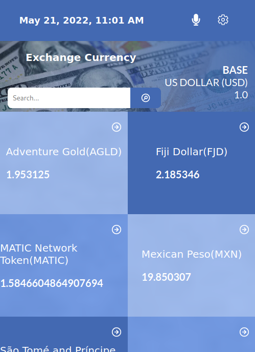

# Currency rate
 CURRENCY RATE is web site that help:
 - View foreign exchange rates and use currency exchange rate calculator for more than 150 foreign currencies.
 - Calculate live currency and foreign exchange rates and  Currency Convertion.
 - Convert between all major global currencies.

- 
- 

## Links 

- [zoom video](https://www.loom.com/share/1d43345a133449549dac92d6cd14e501)
- Project link [here](https://currencyrates1.netlify.app/)

## Built With

- Built with React
- Redux

### Setup

- In the project directory, you can run:
- `npm install`
- `npm start`
- `npm test`

## Author

👤 **Matchoudi**

- GitHub: [@githubhandle](https://github.com/LionRouge1)

## 🤝 Contributing

Contributions, issues, and feature requests are welcome!

Feel free to check the [issues page](../../issues/).

## Show your support

Give a ⭐️ if you like this project!

## Acknowledgments

- Original design idea by Nelson Sakwa on Behance
- Microverse

## 📝 License

This project is [MIT](./MIT.md) licensed.