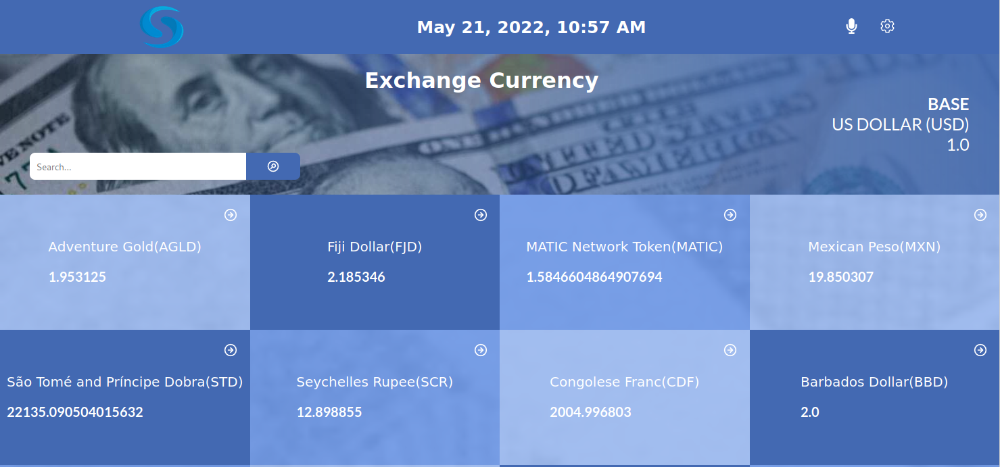

# Currency rate
 CURRENCY RATE is web site that help:
 - View foreign exchange rates and use currency exchange rate calculator for more than 150 foreign currencies.
 - Calculate live currency and foreign exchange rates and  Currency Convertion.
 - Convert between all major global currencies.




## Links 

- Project link [here](https://currencyrates1.netlify.app/)

## Built With

- Built with React
- Redux
- CSS

## Getting Started


To get a local copy up and :

- Open your terminal and cd to the folder where you want to put the project and run :
 ```
https://github.com/LionRouge1/Currency_Exchange.git
 ```

### Prerequisites

- Create-react-app
- Git/Github
- VSCode or another equivalent tool
- Html, Css and Javascript
- Webpack
- APIs
- Jest

### Install

```
npm install
```
```
npm install --save-dev eslint@7.x eslint-config-airbnb@18.x eslint-plugin-import@2.x eslint-plugin-jsx-a11y@6.x eslint-plugin-react@7.x eslint-plugin-react-hooks@4.x @babel/eslint-parser@7.x @babel/core@7.x  @babel/plugin-syntax-jsx@7.x @babel/preset-env@7.x  @babel/preset-react@7.x
```
```
npm install --save-dev stylelint@13.x stylelint-scss@3.x stylelint-config-standard@21.x stylelint-csstree-validator@1.x
```

### Run tests

Run the following tests:

- npm start 
- npm run test
- npx stylelint "**/*.{css,scss}"
- npx eslint .

## Author

👤 **Matchoudi**

- GitHub: [@LionRouge1](https://github.com/LionRouge1)
- Twitter: [@Matchoudi1](https://twitter.com/Matchoudi1)
- LinkedIn: [matchoudi](https://linkedin.com/in/matchoudi)


## 🤝 Contributing

Contributions, issues, and feature requests are welcome!

Feel free to check the [issues page](../../issues/).

## Show your support

Give a ⭐️ if you like this project!

## Acknowledgments

- Original design idea by Nelson Sakwa on Behance
- Microverse

## 📝 License

This project is [MIT](./MIT.md) licensed.
